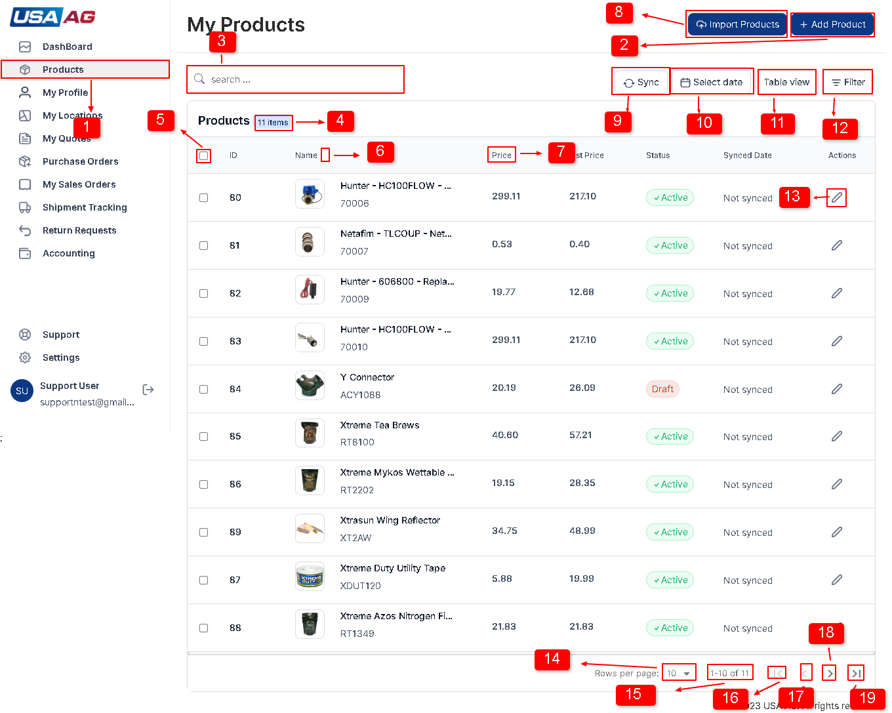
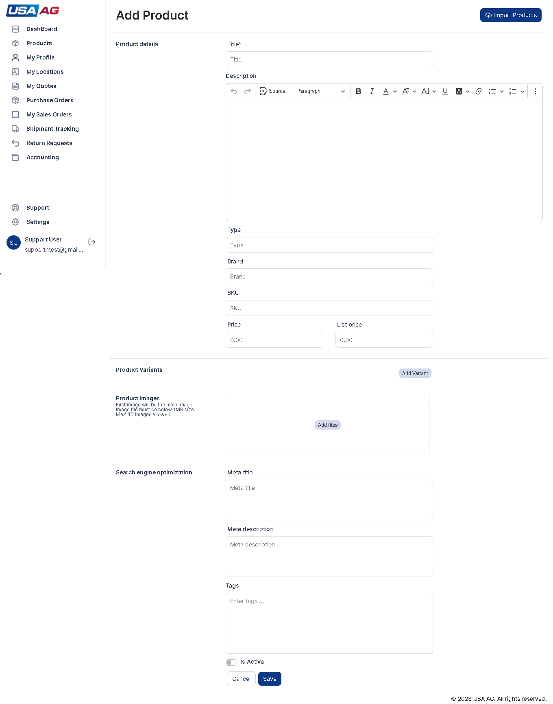
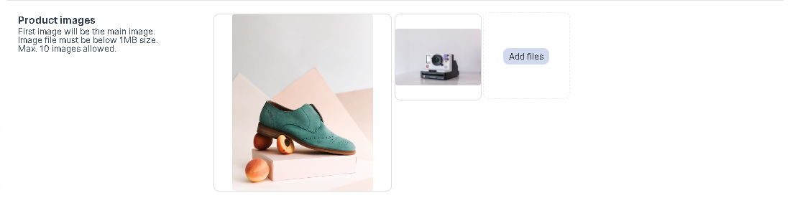
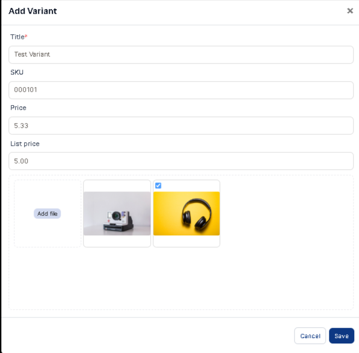
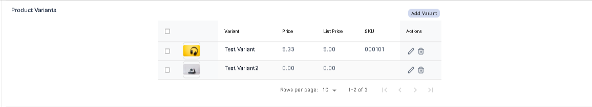
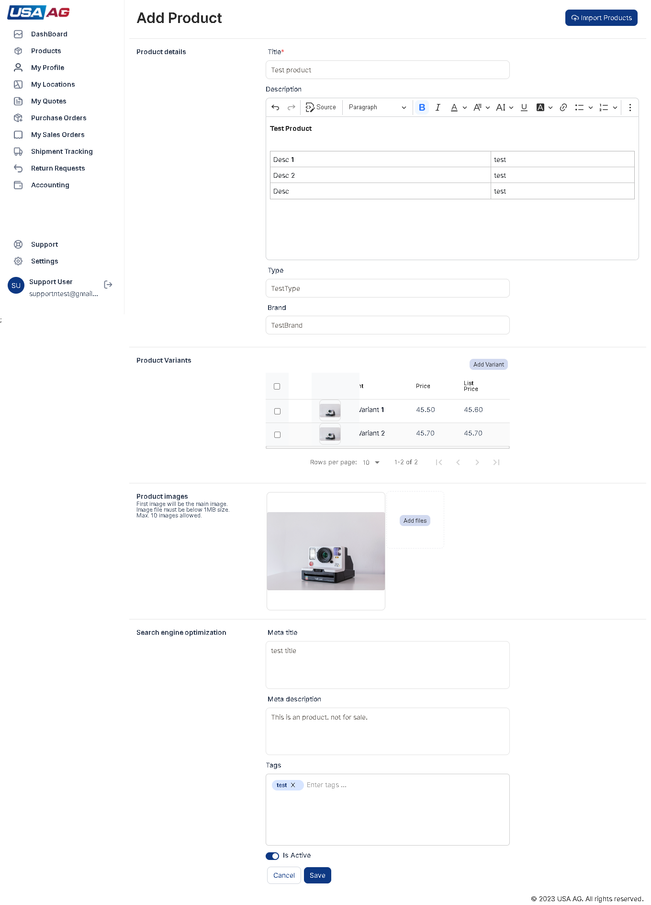

<h1 align="center">
USA AG APPLICATION SUPPORT DOCUMENT
</h1>

<h4>Product Listing?</h4>

**In the product listing page, you will find several elements as indicated by the numbered points in the [Figure 1](#figure-1). Here is a description of each point:**
 

 
Fig: 1 Product list page.

1. This button represents the product list page.
2. Clicking this button will redirect you to the product add form page.
3. The search bar allows you to filter products based on their names.
4. The number indicates the total count of products in the list.
5. The checkbox allows you to select products to perform tasks like deletion or syncing.
6. These icons are used for sorting the table based on the column name when clicked.
7. The column name represents the specific attribute or characteristic of the products displayed in the table.
8. This button redirects you to the import products page.
9. Clicking this button opens a modal that allows you to sync products, either selected, for the current page, or all products.
10. This button opens a modal that enables you to filter products based on specific dates.
11. Clicking this button opens a modal that allows you to select which columns to display in the table.
12. This button opens a modal that enables you to filter data using various options specific to each column.
13. Clicking this button redirects you to the edit product form page for the selected product.
14. This dropdown menu lets you choose the number of products to be displayed per page.
15. This number represents the current range of products being shown out of the total count.
16. Clicking this button takes you to the first page of the product list.
17. This button takes you to the previous page of the product list.
18. This button takes you to the next page of the product list.
19. This button takes you to the last page of the product list.

<h4>Adding an new product?</h4>

**Steps to add an product**

1. After logging in, click on the "Products" option in the right sidebar. Refer to Figure 1, and locate the option marked with point 1.
2. You will be redirected to the products page. On this page, you can see a list of your added products. At the top right of the products page, locate the "Add Product" option marked as point 2 in Figure 1.
3. Click on the "Add Product" option to navigate to the Add Product page. Here, you will find a form with several fields to fill out shown in Figure 2. The fields on the Add Product form include:
    * Title: This is a required field and should be of text type.
    * Description: An editor field that allows you to enter HTML content.
    * Type: A text field.
    * Brand: A text field.
    * SKU: A text field that is not available if the product has variants added.
    * Price: A number field that is not available if the product has variants added.
    * List Price: A number field that is not available if the product has variants added.
    * Images: An image field. The first image set here will be shown on the product listing. You can add, remove, or swap images. The size of each image should be below 1MB, and only allowed image types are accepted. You can add up to 10 images. Shown in Figure 2, 3.
    * Meta Title: A text field.
    * Meta Description: A text field.
    * Tags: A tags field. After entering text in the field, press Enter to add a tag. Tags must be unique.
    * Is Active: A switch field.
    * Variant Title: A unique and required field to add a variant. Shown in Figure 4,5
    * Variant SKU: A text field for the variant.Shown in Figure 4,5
    * Variant Price: A number field for the variant price.Shown in Figure 4,5
    * Variant List Price: A number field for the variant list price.Shown in Figure 4,5
    * Variant Image: An image field for the variant. You can only add one image, and the maximum image size is 1MB.Shown in Figure 4,5

 
Fig: 2 Add product form page.

 

 
Fig: 3 Add Variant image.

 

 
Fig: 4 Add Variant image.

4. Fill the fields in form with information like shown in Shown in Figure 2, 3, 4

 
Fig: 5 Variant list image.

5. After filling out the necessary information, click the "Save" option to add the product. If product is added successful it add product to products list and if there is error it will show error in error box right top corner of page as shown in Figure 6.

 
Fig: 6 Save and Cancel button image.
6. If you decide to cancel, all the entered data in the fields will be removed, and you will be redirected to the product listing page shown in Figure 6.

<h4>Edit an product?</h4>

**Steps to edit an product**
 

1. In product listing page you can see edit button in product row marked as point 13 in Figure 1 .On click you will be redirected to Edit product page.
2. You will be redirected to the product's edit page, where you can make changes to the product details.Show in Figure 7
3. On the edit page, you will find a form with various fields to update the product information. The fields are described in "Adding an Product" step 3.

 
Fig: 7 Product list page.

4. Make the necessary modifications to the product details within the form.
5. Once you have finished editing the product, click the "Update" option to save the changes.
6. If you decide to discard the changes and revert to the original product details, you can click the "Cancel" option. This will discard any modifications made and redirect you back to the product listing page.

<h4>Location Listing?</h4>
**In the My location listing page, you will find several elements as indicated by the numbered points in the Figure 1. Here is a description of each point:**

1. This button represents the My location list page.
2. Header in listing page.
3. The search bar allows you to filter location based on their warehouse names.
4. The number indicates the total count of location in the list.
5. Check box to select all table data show for process like deletion.
6. These icons are used for sorting the table based on the column name when clicked.
7. The checkbox allows you to select location single selection.
8. This button redirects you to the import locations page.
9. Clicking this button will redirect you to the location add form page.
10. This button opens a modal that enables you to filter location based on specific dates. as shown in Figure 2.
11. Clicking this button opens a modal that allows you to select which columns to display in the table.as shown in Figure 3.
12. This button opens a modal that enables you to filter data using various options specific to each column.
13. Show button for view location page.
14. Show button for edit location page.
15. This dropdown menu lets you choose the number of locations to be displayed per page.
16. This number represents the current range of locations being shown out of the total count.
17. Clicking this button takes you to the first page of the location list.
18. This button takes you to the previous page of the location list.
19. This button takes you to the next page of the location list.
20. This button takes you to the last page of the location list.
21. The column name represents the specific attribute or characteristic of the location displayed in the table.
22. This point indicates list table header.

<h4>Adding an new location?</h4>

**Steps to add an location**

1. Click on the "My Locations" option in the right sidebar. Refer to Figure 1, and locate the option marked with point 1.
2. You will be redirected to the My locations page. On this page, you can see a list of your added Warehouse locations. At the top right of the My locations page, locate the "Add Location" option marked as point 2 in Figure 1.

